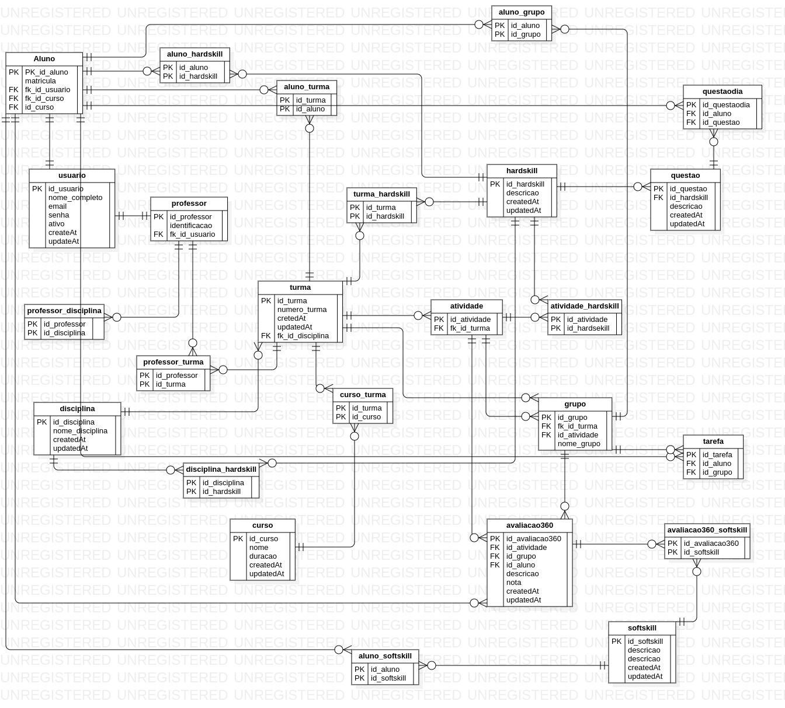

<h1 align="center"> Api_grupou_BD  </h1>

## Descrição do projeto

<p align=justify>APS e AV2 da disciplina de desenvolvimento de aplicações de banco de dados</p>

### Principais funcionalidades

API de acesso a um banco de dados mySQL

- Criação do banco banco de dados a partir dos seu modelos
- CRUD dos dados presentes no banco de dados
  - Cadastro dos dados
  - Listar todos os dados presentes no banco e nas tabelas
  - Atualizar os dados
  - remover um dado do banco
  - Buscar um item do banco

> Status do Projeto: Concluído :heavy_check_mark:

### Como rodar a aplicação

No terminal do seu computador clone o projeto:

```
git clone git@github.com:Jonathan220/api_grupou_BD.git
```

Entre na pasta do projeto

```
cd
```

Instale as dependencias

```
npm install
```

Instale o dotenv para criar as variáveis de ambiente

```
npm install --save-dev dotenv
```

Crie o arquivo .env para colocar as variáveis de ambiente

```
touch .env
```

Dentro do arquivo .env coloque a variável de ambiente e o valor de acordo com o seu banco de dados

```
USER_DATABASE=usuario
PASSWORD_DATABASE=senha
BANCO_DATABASE=grupou_db
PORT=porta do banco da dados
```

Execute a api

```
node server.js
```

Para testar as rotas faça uso do programa insomnia ou postman

- [Insomnia](https://insomnia.rest)
- [Postman](https://www.postman.com)

### Linguagens, dependencias e libs utilizadas

- [javascript](https://developer.mozilla.org/en-US/docs/Web/javascript)
- [express](http://expressjs.com/pt-br/)
- [mySQL2](https://www.npmjs.com/package/mysql2)
- [Sequelize](https://www.npmjs.com/package/sequelize)

### Modelo do banco de dados


